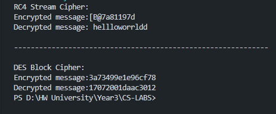

# Laboratory work nr 2, Stream and Block Ciphers

### Course: Cryptography & Security
### Author: Grosu Damian

---

## Theory
A stream cipher is an encryption algorithm that encrypts 1 bit or byte of plaintext at a time. It uses an infinite stream of pseudorandom bits as the key. For a stream cipher implementation to remain secure, its pseudorandom generator should be unpredictable and the key should never be reused. Stream ciphers are designed to approximate an idealized cipher, known as the One-Time Pad. <br />
<br />
A block cipher is an encryption algorithm that encrypts a fixed size of n-bits of data - known as a block - at one time. The usual sizes of each block are 64 bits, 128 bits, and 256 bits. So for example, a 64-bit block cipher will take in 64 bits of plaintext and encrypt it into 64 bits of ciphertext. In cases where bits of plaintext is shorter than the block size, padding schemes are called into play. Majority of the symmetric ciphers used today are actually block ciphers. DES, Triple DES, AES, IDEA, and Blowfish are some of the commonly used encryption algorithms that fall under this group.


## Objectives
1. Get familiar with the symmetric cryptography, stream and block ciphers.

2. Implement an example of a stream cipher.

3. Implement an example of a block cipher.

4. The implementation should, ideally follow the abstraction/contract/interface used in the previous laboratory work.

5. Please use packages/directories to logically split the files that you will have.

6. As in the previous task, please use a client class or test classes to showcase the execution of your programs.


## Implementation description
* RC4 Stream Cipher<br />

**RC4** means Rivest Cipher 4 invented by Ron Rivest in 1987 for RSA Security. It is a Stream Ciphers. Stream Ciphers operate on a stream of data byte by byte. RC4 stream cipher is one of the most widely used stream ciphers because of its simplicity and speed of operation. It is a variable key-size stream cipher with byte-oriented operations. It uses either 64 bit or 128-bit key sizes.
The first step of the algorithm is the initialization of array, the array is of the size 256 and every element in the array we initialize from sbox[i] to i, method that initialize is this one:
```
private int[] initSbox(byte[] key){
        int[] sbox = new int[SBOX_LENGTH];
        int j = 0;

        for (int i = 0; i < SBOX_LENGTH; i++) {
            sbox[i] = i;
        }

        for (int i = 0; i < SBOX_LENGTH; i++) {
            j = (j + sbox[i] +(key[i % key.length]) & 0xFF) % SBOX_LENGTH;
            swap(i, j, sbox);
        }
        return sbox;
    }
```

After that we are running the Key Scheduling Algorithm, in this algorithm we are having two variable i and j. We are using these variables to rearrange the array. Rearranging the array is done by using a secret key and obtained array is used to get the keystream.
```
public byte[] crypt(final byte[] message){
        sbox = initSbox(key);
        byte[] code = new byte[message.length];
        int i = 0;
        int j = 0;
        for (int n = 0; n < message.length; n++) {
            i = (i + 1) % SBOX_LENGTH;
            j = (j + sbox[i]) % SBOX_LENGTH;
            swap(i, j, sbox);
            int rand = sbox[(sbox[i] + sbox[j]) % SBOX_LENGTH];
            code[n] = (byte) (rand ^ message[n]); 
        }
        return code;
    }
```

For encryption and decryption we have following 2 methods where arrays are reseting for encrypting new messages

```
public byte[] encrypt(String message, String key) throws InvalidKeyException{
        return encrypt(message, StandardCharsets.UTF_8, key);
    }

public String decrypt(byte[] message, Charset charset, String key) throws InvalidKeyException{
        reset();
        setKey(key);
        byte[] msg = crypt(message);
        reset();
        return new String(msg);
    }
```
And also we have an exception class for invalid keys:
```
public class InvalidKeyException extends RuntimeException{

    public InvalidKeyException(String message) {
        super(message);
    }
    
}
```
* DES Block Cipher<br />

**DES** is a block cipher and encrypts data in blocks of size of 64 bits each, which means 64 bits of plain text go as the input to DES, which produces 64 bits of ciphertext. The same algorithm and key are used for encryption and decryption, with minor differences. The key length is 56 bits.
So, we have the following method for encryprion:
```
public String encrypt(String plainText, String key) {
        int i;
        // get round keys
        String keys[] = getKeys(key);

        // initial permutation
        plainText = permutation(IP, plainText);

        // 16 rounds
        for (i = 0; i < 16; i++) {
            plainText = round(plainText, keys[i], i);
        }

        // 32-bit swap
        plainText = plainText.substring(8, 16)
                + plainText.substring(0, 8);

        // final permutation
        plainText = permutation(IP1, plainText);
        return plainText;
    }
```
The first step of the current algorithm is the permutation function, the initial permutation replaces the first bit of the original plain text block with the 58th bit of the original plain text, the second bit with the 50th bit of the original plain text block, and so on. The permutation function:
```
private String permutation(int[] sequence, String input) {
        String output = "";
        input = hextoBin(input);
        for (int i = 0; i < sequence.length; i++)
            output += input.charAt(sequence[i] - 1);
        output = binToHex(output);
        return output;
    }
```
Next we have that initial permutation is producing 2 halves of permuted blocks, left and right, nad each half is going through 16 rounds encryption process, these things are executed in this function:
```
private String round(String input, String key, int num) {
        // fk
        String left = input.substring(0, 8);
        String temp = input.substring(8, 16);
        String right = temp;
        // Expansion permutation
        temp = permutation(EP, temp);
        // xor temp and round key
        temp = xor(temp, key);
        // lookup in s-box table
        temp = sBox(temp);
        // Straight D-box
        temp = permutation(P, temp);
        // xor
        left = xor(left, temp);

        // swapper
        return right + left;
    }
```
And after that, or better to say in the end we are combining back the 2 parts in final permutation, the result of the preocess is 64-bit ciphertext.


## Conclusions and Results
The results of all ciphers are in the screenshot below: <br />


In conclusion, this laboratory work was elaborated successful, during the work on lab, I found out new information about stream and block cipher, I found out some new cipher that can be used. Also all objectives that were propesed, has been achieved, this meaning that 2 cipher were implemented succesfully.