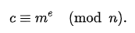
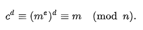
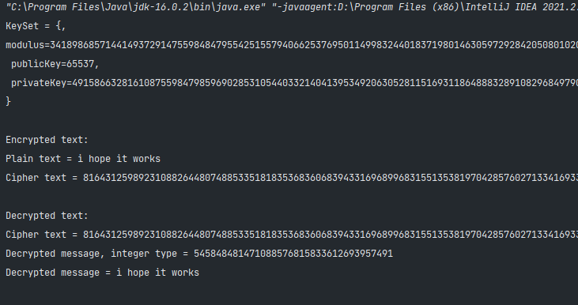

# Laboratory work nr 3, Asymmetric Ciphers

### Course: Cryptography & Security
### Author: Grosu Damian

----

## Theory
Asymmetric ciphers are also referred to as ciphers with public and private keys. They use two keys, one for encryption of 
messages and the other one during decryption.</br>
The public key is widely known and everybody can use it to encrypt any messages. The idea of asymmetric encryption is that 
only the owner of the second key (the private key, which is not known to anybody else), can decrypt the message. Similarly, data encrypted with the private key can only be decrypted with the corresponding public key.


## Objectives:
* Get familiar with the basics of asymmetric ciphers.
* Implement one asymmetrical cipher.


## Implementation description
### RSA Cipher
To make the encryption in this algorithm we need public key, private key and modulus, so for storing them was created a 
class __KeySet__ where we have constructor and getters, now that we can store these keys, let's go to key generator.</br>
To generate keys we will need prime numbers a bit list of them is in class __Primes__. So the generation, here we also need 
a pseudorandom number generator which was taken from java libraries, SecureRandom
```
SecureRandom secureRandom = new SecureRandom();
```
so firstly we are generating 2 large prime numbers p and q
```
BigInteger p = BigInteger.valueOf(2);
        while(isDivisibleByPrime(p.add(BigInteger.ONE)) && isDivisibleByPrime(p.subtract(BigInteger.ONE)))
            p = BigInteger.probablePrime(2048, secureRandom);

        BigInteger q = BigInteger.valueOf(2);
        while (isDivisibleByPrime(q.add(BigInteger.ONE)) && isDivisibleByPrime(q.subtract(BigInteger.ONE)))
            q = BigInteger.probablePrime(2050, secureRandom);
```
here there are known factoring methods for n = p*q if p+-1 or q+-1 has only small prime factors. These are due to Pollard and Williams. 
So we include a special method called “isDivisibleByLargePrime”, and screen our candidate prime numbers against its negation.
The largest prime we test for is 65537, the 6543rd prime.
```
 public boolean isDivisibleByPrime(BigInteger n){
        BigInteger reduced = n;
        boolean foundDivisor = true;

        while (foundDivisor && !reduced.equals(BigInteger.ZERO)){
            foundDivisor = false;

            for (BigInteger p : bigIntegerPrimes){
                if (reduced.mod(p).equals(BigInteger.ZERO)){
                    reduced = reduced.divide(p);
                    foundDivisor = true;
                    break;
                }
            }
        }

        return reduced.compareTo(BigInteger.valueOf(65537)) <= 0;
    }
```
After finding those 2 primes, we are computing n(modulus)
```
BigInteger n = p.multiply(q);
```
n is used as the modulus for both the public and private keys. Its length, usually expressed in bits, is the key length.</br>
The third step now is computing totient(in the code tmp), which is Carmichael's totient function: φ(n) = (p-1)(q-1)
```
BigInteger tmp = p.subtract(BigInteger.ONE).multiply(q.subtract(BigInteger.ONE));
```
which inverse modulus will be our private key(d - private key).
```
BigInteger d = e.modInverse(tmp);
```
so in the final we have our key set:
```
return new KeySet(n, e, d);
```
where n - modulus, e - public key, d - private key, about e, public key was chosen  65537 because we notice that the choice 
of public key is arbitrary. Since everyone is allowed to know it, it shouldn’t matter what we pick. Of course, this is a bit too naive, 
and it has been proven that if the public key  is small (say, ), then the RSA encryption is less secure. After twenty years 
of attacks trying to break RSA, it has been generally accepted that public keys with moderate bit-length and small Hamming 
weight (few 1’s in their binary expansion) are secure. So, the most commonly used public key is 65537.<br>
The encryption itself it not really complicated, first we are transforming plaintext in bytes, and after we are doing encryption after 
the formula </br>

</br>
and in the code:
```
public BigInteger encrypt(BigInteger plainTest, BigInteger publicKey, BigInteger modulus){
        return plainTest.modPow(publicKey, modulus);
    }
```
for the decryption, the formula:</br>

</br>
and the code:
```
public BigInteger decrypt(BigInteger cipherText, BigInteger privateKey, BigInteger modulus){
        return cipherText.modPow(privateKey, modulus);
    }
```

## Results


## Conclusion
In conclusion, during of elaborating of laboratory work was studied theory about asymmetric ciphers, especially about RSA, also was
implemented this algorithm with success by the results which was obtained.


