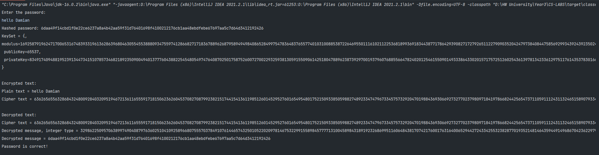

# Laboratory work nr 3, Hash functions and Digital Signatures.

### Course: Cryptography & Security
### Author: Grosu Damian

---
## Theory
Asymmetric ciphers are also referred to as ciphers with public and private keys. They use two keys, one for encryption of
messages and the other one during decryption.</br>
The public key is widely known and everybody can use it to encrypt any messages. The idea of asymmetric encryption is that
only the owner of the second key (the private key, which is not known to anybody else), can decrypt the message. Similarly, 
data encrypted with the private key can only be decrypted with the corresponding public key.

__The RSA__ algorithm is an asymmetric cryptography algorithm; this means that it uses a public key and a private key (i.e 
two different, mathematically linked keys). As their names suggest, a public key is shared publicly, while a private key is secret and must not be shared with anyone.
The RSA algorithm is named after those who invented it in 1978: Ron Rivest, Adi Shamir, and Leonard Adleman.

__SHA-2__ (Secure Hash Algorithm 2) is a set of cryptographic hash functions designed by the United States National Security Agency 
(NSA) and first published in 2001. They are built using the Merkle–Damgård construction, from a one-way compression function itself 
built using the Davies–Meyer structure from a specialized block cipher. __SHA-384__ belongs to the SHA-2 family of cryptographic hashes. 
It produces the 384 bit digest of a message. __SHA-384__ is roughly 50% faster than SHA-224 and SHA-256 on 64-bit machines, even if its digest is longer.

## Objectives:
1. Get familiar with the hashing techniques/algorithms.
2. Use an appropriate hashing algorithms to store passwords in a local DB.
    1. You can use already implemented algortihms from libraries provided for your language.
    2. The DB choise is up to you, but it can be something simple, like an in memory one.
3. Use an asymmetric cipher to implement a digital signature process for a user message.
    1. Take the user input message.
    2. Preprocess the message, if needed.
    3. Get a digest of it via hashing.
    4. Encrypt it with the chosen cipher.
    5. Perform a digital signature check by comparing the hash of the message with the decrypted one.


## Implementation description
The implementation of RSA algorithm can be find following this link: [RSA](https://github.com/Damyy17/cs_labs/tree/main/src/main/java/Ciphers/AsymmetricCiphers).

For the implementation of the SHA-384 algorithm was used a java library, Message Digest, the method for hashing looks 
like this:
```
 MessageDigest messageDigest = MessageDigest.getInstance("SHA-384");
            messageDigest.update(salt.getBytes());
            byte[] bytes = messageDigest.digest(passwordToHash.getBytes());
            StringBuilder sb = new StringBuilder();
            for (byte aByte : bytes) {
                sb.append(Integer.toString((aByte & 0xff) + 0x100, 16)
                        .substring(1));
            }
            generatedPassword = sb.toString();
```
it returns the generated hash. Another method, in the class SHA-384, that improves the algorithm is getSalt:
```
public String getSalt() throws NoSuchAlgorithmException{
        SecureRandom secureRandom = SecureRandom.getInstance("SHA1PRNG");
        byte[] salt = new byte[16];
        secureRandom.nextBytes(salt);
        return Arrays.toString(salt);
    }
```
we are using this method for adding random data to the input of a hash function to guarantee a unique output. The unique 
hash that is produced by adding the salt can protect us against different attack vectors, such as hash table attacks, while 
slowing down dictionary and brute-force offline attacks.

And after getting the hash we are adding the password into a database class which has a list and 2 methods:
```
private final List<String> passwords = new ArrayList<>();

    public void addToDB(String password){
        passwords.add(password);
    }

    public boolean checkDbIfContains(String password){
        return passwords.contains(password);
    }
```

## Results

In conclusion, during of elaborating of laboratory work was studied theory about hashing and especially about SHA-384 algorithm,
that was implemented successfully by the results which was obtained. Also, during the laboratory work, I found out how can hash founctions can be
improved by adding salt, which gives better results.


