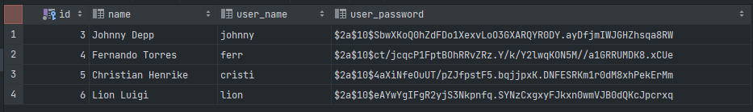
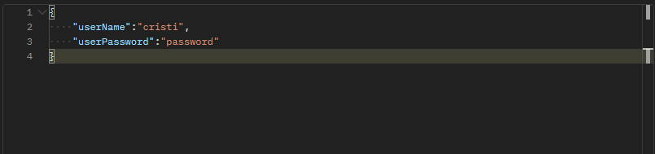
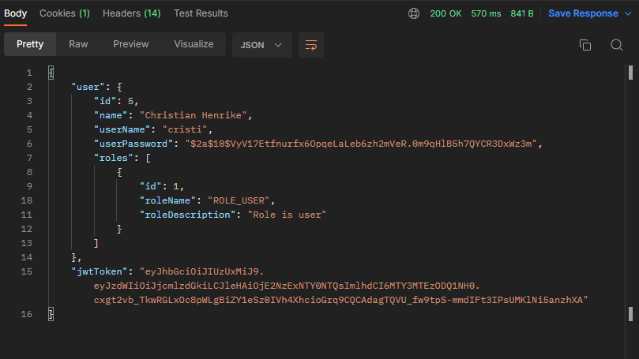
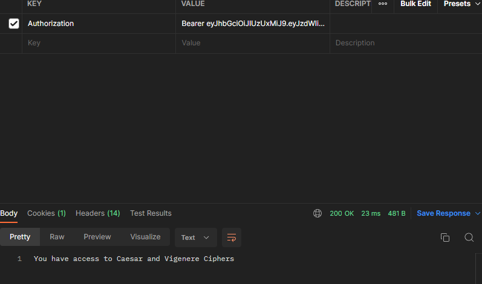
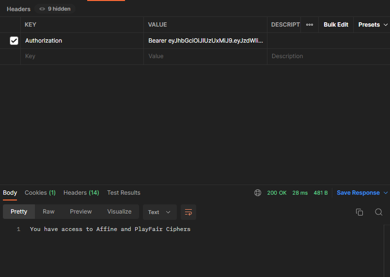

# Laboratory work nr 5, Authentication and Authorization.

### Course: Cryptography & Security
### Author: Grosu Damian

---
## Overview

&ensp;&ensp;&ensp; Authentication & authorization are 2 of the main security goals of IT systems and should not be used interchangibly. Simply put, during authentication the system verifies the identity of a user or service, and during authorization the system checks the access rights, optionally based on a given user role.

&ensp;&ensp;&ensp; There are multiple types of authentication based on the implementation mechanism or the data provided by the user. Some usual ones would be the following:
- Based on credentials (Username/Password);
- Multi-Factor Authentication (2FA, MFA);
- Based on digital certificates;
- Based on biometrics;
- Based on tokens.

&ensp;&ensp;&ensp; Regarding authorization, the most popular mechanisms are the following:
- Role Based Access Control (RBAC): Base on the role of a user;
- Attribute Based Access Control (ABAC): Based on a characteristic/attribute of a user.


## Objectives:
1. Take what you have at the moment from previous laboratory works and put it in a web service / serveral web services.
2. Your services should have implemented basic authentication and MFA (the authentication factors of your choice).
3. Your web app needs to simulate user authorization and the way you authorise user is also a choice that needs to be done by you.
4. As services that your application could provide, you could use the classical ciphers. Basically the user would like to get access and use the classical ciphers, but they need to authenticate and be authorized. 


## Implementation Description:
So from the begging I will start with connecting with a database, database that I will use will be PostgresSQL, and also from here I will add 4 users, 2 roles
when program will start:
```
userService.saveRole(new Role(null, "ROLE_USER", ""));
userService.saveRole(new Role(null, "ROLE_ADMIN", ""));

userService.saveUser(new User(null, "Johnny Depp", "johnny", userService.getEncodedPassword("1234"), new HashSet<>()));
userService.saveUser(new User(null, "Fernando Torres", "ferr", userService.getEncodedPassword("tores1"), new HashSet<>()));
userService.saveUser(new User(null, "Christian Henrike", "cristi", userService.getEncodedPassword("password"), new HashSet<>()));
userService.saveUser(new User(null, "Lion Luigi", "lion", userService.getEncodedPassword("lion"), new HashSet<>()));
```
The password will be encoded with bcrypt and the result can be seen in the database:


### Authentication and Authorization
Authentication in the web service takes place through credentials, this means through username and password:

And as response we can see that password will be encrypted, user has a role and also was returned an authorization token of type jwt:


Now about authorization, the JWT Token is s an open standard that defines a compact and self-contained way for securely 
transmitting information between parties as a JSON object, it is generated after a successful login. Algorithm that was used for this token was 
HMAC-SHA512, also this token expires every 5 hours:
```
public String generateToken(UserDetails userDetails) {
        Map<String, Object> claims = new HashMap<>();

        return Jwts.builder()
                .setClaims(claims)
                .setSubject(userDetails.getUsername())
                .setIssuedAt(new Date(System.currentTimeMillis()))
                .setExpiration(new Date(System.currentTimeMillis() + TOKEN_VALIDITY * 1000))
                .signWith(SignatureAlgorithm.HS512, SECRET_KEY)
                .compact();
    }
```
The Web Security Configuration looks like this:
```
protected void configure(HttpSecurity httpSecurity) throws Exception {
        httpSecurity.cors();
        httpSecurity.csrf().disable()
                .authorizeRequests().antMatchers("/authenticate", "/registerNewUser").permitAll()
                .antMatchers(HttpHeaders.ALLOW).permitAll()
                .anyRequest().authenticated()
                .and()
                .exceptionHandling().authenticationEntryPoint(jwtAuthenticationEntryPoint)
                .and()
                .sessionManagement().sessionCreationPolicy(SessionCreationPolicy.STATELESS)
        ;

        httpSecurity.addFilterBefore(jwtRequestFilter, UsernamePasswordAuthenticationFilter.class);
    }
```
and this allows (including unauthenticated users) to access to the URLs “/authenticate” and “/registerNewUser”, 
ensures that any request to our application requires the user to be authenticated and etc.

More about authorization and roles we have 2 roles, where user role should have possibility to access 2 classical ciphers

```
 @GetMapping({"/forRoleUser"})
    @RolesAllowed("ROLE_USER")
    public String forRoleUser(){
        return "You have access to Caesar and Vigenere Ciphers";
    }
```
and for admin, access to other 2 classical ciphers(before that we authenticates as another user, johny, which is an admin):

```
@GetMapping({"/forAdminUser"})
    @RolesAllowed("ROLE_ADMIN")
    public String forAdminUser(){
        return "You have access to Affine and PlayFair Ciphers";
    }
```
the functionality of the ciphers is to be implemented in the near future.

## Conclusions
During the laboratory work was studied how can be created authentication and authorization by roles and tokens in the Java Spring Boot. So in result we got an webservice, where users can use ciphers by roles that they have.


